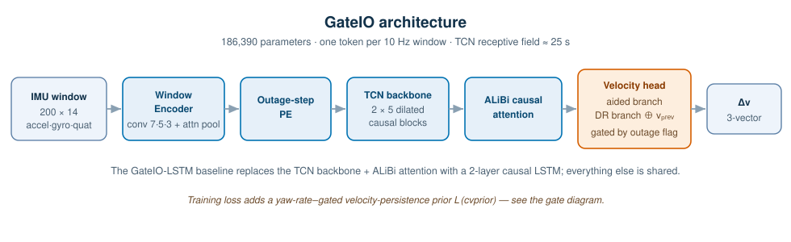
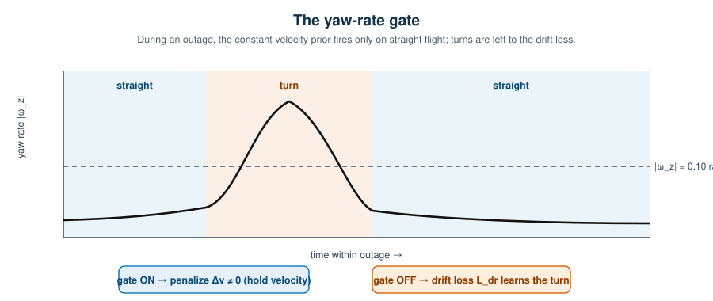
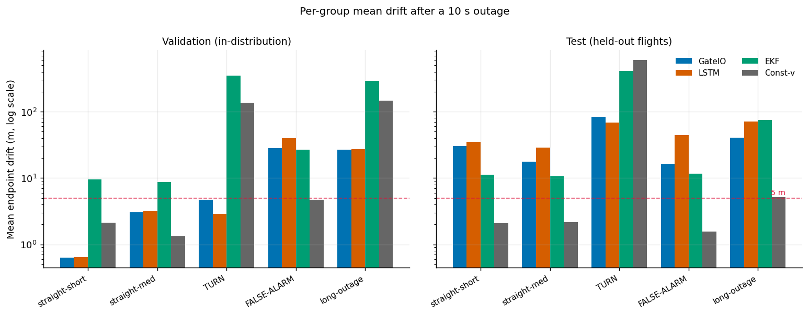
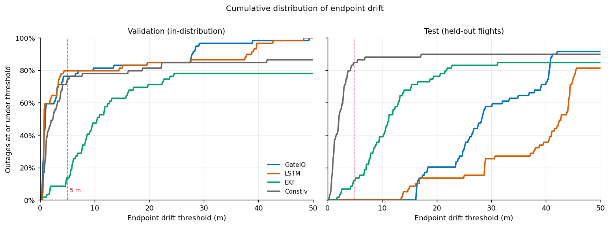
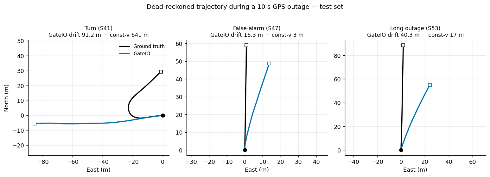

# GateIO — Yaw-Rate-Gated Learned Dead Reckoning for UAV GPS-Outage Bridging

GateIO predicts GPS velocity from inertial data during a GPS outage and integrates
those predictions to estimate position. Its distinguishing component is a
**yaw-rate-gated velocity-persistence prior**: during straight flight the model is
penalized for predicting velocity *changes* (a constant-velocity prior), and the
gate switches off during turns so the drift loss — and only the drift loss — teaches
turning dynamics.

**What the results support (read this first).** On sequences drawn from the same
flights as training (validation), GateIO bridges a 10 s outage with **6.72 m mean
drift** and keeps **76% of outages under 5 m**. On a **sealed test set of held-out
flight segments**, this does *not* transfer: GateIO's error on straight motion rises
to ~30 m, and a naive constant-velocity baseline is more accurate on the typical case
(2.06 m median vs 28.24 m). GateIO's robust, split-independent contribution is that
it — like the LSTM, and unlike the EKF and constant-velocity baselines — **avoids the
catastrophic dead-reckoning blow-up that occurs during turns** (up to ~600 m for the
classical baselines). Treat GateIO as evidence for that specific claim, not as a
general-purpose outage-bridging solution. See [Limitations](#limitations).

---

## Method

GateIO encodes each 1 s IMU window (200 samples × 14 channels) into a single token,
adds a positional encoding of *elapsed outage steps*, mixes tokens with a causal TCN
and ALiBi attention, and decodes velocity with a dual-branch head that fuses the last
known GPS velocity during outages.



The recurrent baseline, **GateIO-LSTM**, is identical except that the TCN + attention
backbone is replaced by a 2-layer causal LSTM — isolating the contribution of the
convolutional/attention backbone.

### The yaw-rate gate

The training loss combines a GPS-aided term, an outage dead-reckoning term (`L_dr`),
and the gated constant-velocity prior (`L_cvprior`). On outage windows with
`|ω_z| < 0.10 rad/s` (straight cruise) the prior pushes the predicted velocity change
toward zero; above the threshold (turns) the gate is off and `L_dr` alone shapes the
prediction. An earlier *ungated* prior competed with `L_dr` on turns and was
overwhelmed — gating is what makes the prior safe to weight heavily.



| Loss term | Where it applies | Weight |
|---|---|---|
| `L_data` — Huber on GPS velocity | GPS-aided windows | 1.0 |
| `L_dr` — Huber, vertical-axis-weighted | all outage windows | 0.90 |
| `L_cvprior` — push Δv→0 | outage windows with `|ω_z|<0.10 rad/s` | 0.50 |
| `L_smooth` — jerk penalty | whole sequence | 0.001 |
| `L_phys` (ZUPT), `L_drift` (position) | warmed in after epoch 30 | ≤0.01 / 0.002 |

GateIO has **186,390 parameters**; the TCN receptive field spans ≈ 25 s of context.

---

## Results

Endpoint drift in metres after a 10 s outage, 59 sequences per split. **Bold** = best
in row. `Const-v` holds the last known GPS velocity through the outage.

### Per-group mean drift (m)

| Group (N) | Split | GateIO | LSTM | EKF | Const-v |
|---|---|---:|---:|---:|---:|
| straight-short (35) | val | **0.63** | 0.64 | 9.51 | 2.11 |
|                     | test | 30.39 | 35.26 | 11.24 | **2.08** |
| straight-med (6)    | val | 3.04 | 3.18 | 8.66 | **1.31** |
|                     | test | 17.48 | 28.83 | 10.72 | **2.17** |
| TURN (6)            | val | 4.73 | **2.90** | 351.64 | 135.79 |
|                     | test | 83.73 | **68.48** | 408.56 | 598.18 |
| FALSE-ALARM (6)     | val | 28.08 | 39.62 | 26.62 | **4.68** |
|                     | test | 16.28 | 44.33 | 11.56 | **1.56** |
| long-outage (6)     | val | **26.59** | 27.09 | 293.10 | 147.21 |
|                     | test | 40.65 | 70.56 | 75.45 | **5.19** |

### Overall

| Metric | Split | GateIO | LSTM | EKF | Const-v |
|---|---|---:|---:|---:|---:|
| Mean (m)     | val  | **6.72** | 7.78 | 74.80 | 30.64 |
|              | test | **34.11** | 42.50 | 58.16 | 62.97 |
| Median (m)   | val  | 0.90 | **0.73** | 10.44 | 2.37 |
|              | test | 28.24 | 42.79 | 11.19 | **2.06** |
| 90th pct (m) | val  | **27.82** | 37.95 | 287.79 | 117.09 |
|              | test | **41.36** | 70.71 | 165.23 | 96.43 |
| % under 5 m  | val  | 76.3% | **79.7%** | 13.6% | 74.6% |
|              | test | 0.0% | 0.0% | 11.9% | **84.7%** |

Per-sequence results are in [`results/val_all_results.csv`](results/val_all_results.csv)
and [`results/test_all_results.csv`](results/test_all_results.csv).

**Per-group mean drift, validation vs test.** The learned models keep turns bounded
where the classical baselines diverge; on held-out flights they pay a large fixed cost
on straight segments.



**Cumulative distribution of drift.** In-distribution the learned models dominate;
out-of-distribution the constant-velocity baseline (grey) reaches the 5 m mark far
sooner than GateIO.



**Dead-reckoned trajectories (sealed test set).** A turn, a false-alarm, and a long
outage. On the turn, GateIO drifts 91 m but the constant-velocity baseline drifts
641 m; on straight/false-alarm segments GateIO drifts more than simply holding
velocity would.



---

## Repository layout

```
gateio/
├── models/gateio.py            GateIO + GateIO-LSTM architecture (importable)
├── train/train_gateio.py       training loop (script; no Colab needed)
├── eval/
│   ├── ekf_baseline.py         quaternion gravity-compensated EKF baseline
│   └── evaluate.py             run all four models, print tables, save CSVs
├── data/
│   ├── data_loader.py          MARSDataset (windowing, normalization, outage sim)
│   └── preprocess/             raw-bag → NPZ preprocessing (v2 = paper split)
├── notebooks/                  cleaned training / evaluation notebooks (01–04)
├── results/                    per-sequence CSVs, trajectory arrays, figures
└── paper/                      preprint (PDF)
```

## Installation

```bash
git clone https://github.com/nandini1612/gateio.git
cd gateio
pip install -r requirements.txt
```

PyTorch ≥ 2.6 is supported; the provided checkpoints must be loaded with
`weights_only=False` (they bundle numpy arrays alongside the weights).

## Reproducing the results

Quick architecture self-test (no data needed) — prints `186,390` parameters:

```bash
python models/gateio.py
```

Evaluate all four systems on a split (needs the dataset and both checkpoints):

```bash
python eval/evaluate.py \
    --data path/to/MARS_Master_Dataset.npz \
    --gateio-ckpt path/to/marsnet_r20_final.pt \
    --lstm-ckpt   path/to/marsnet_lstm_best.pt \
    --split val --out-dir results
```

The evaluation prints a per-sequence sanity check that must land on
`S0 ≈ 0.29 m, S41 ≈ 2.55 m, S47 ≈ 29.08 m` and a validation mean of **6.72 m**. If
those are off, the dataset is the wrong version (see [Dataset](#dataset)).

Train from scratch (GateIO or the LSTM baseline):

```bash
python train/train_gateio.py --data path/to/MARS_Master_Dataset.npz \
    --model gateio --ckpt-dir ./checkpoints
```

Run the EKF baseline alone (re-tune with `--tune`):

```bash
python eval/ekf_baseline.py --data path/to/MARS_Master_Dataset.npz
```

## Dataset

Results use the **v2 within-flight chronological 80/10/10 split** derived from the
[MARS-LVIG dataset](https://mars.hku.hk/dataset.html) (Li et al., 2024) UAV logs:
59 validation and 59 test sequences, each a 30 s window at 10 Hz with a simulated
10 s outage. The normalization statistics of the correct file are
`Y_iqr = [1.516, 7.985, 0.100]`, `Y_median = [-0.146, 0.820, 0.003]`, and it reports
59 validation sequences. A file with `Y_iqr = [0.1, 0.1, 0.1]` or a different sequence
count is the in-development bag-level (v3) dataset and will **not** reproduce these
numbers. Regenerate the v2 file with `data/preprocess/combine_and_norm_v2.py`.

## Limitations

Our headline validation metrics (6.72 m mean, 76% of outages under 5 m) are measured
on a within-flight chronological split, in which validation sequences are temporally
adjacent to training data from the same flights. On the sealed test set — held-out
segments whose flight dynamics the model has not seen — GateIO's error rises sharply on
non-turning motion (straight-short: 0.63 m → 30.4 m), and a naive constant-velocity
baseline attains lower median error (2.06 m vs 28.24 m) and stays under 5 m far more
often (84.7% vs 0%). GateIO retains an advantage only in mean drift, and only because
it avoids the catastrophic dead-reckoning failure that the constant-velocity and EKF
baselines exhibit during turns (up to 598 m and 645 m respectively). We therefore read
these results as evidence for a specific claim — that a yaw-rate-gated learned
dead-reckoning model prevents turn-induced divergence where classical filters diverge —
rather than as a general-purpose GPS-outage bridging solution. The gap between
validation and test performance indicates the model partly fits flight-specific
dynamics under the within-flight split; a bag-level split that fully isolates flights,
together with retraining, is required to measure true cross-flight generalization and
is left to future work.

## License

Released under the [MIT License](LICENSE).

## Citation

```bibtex
@misc{gateio2026,
  title  = {GateIO: Yaw-Rate-Gated Learned Dead Reckoning for UAV GPS-Outage Bridging},
  author = {Saxena, Nandini},
  year   = {2026},
  note   = {Preprint},
  url    = {https://github.com/nandini1612/gateio}
}
```
