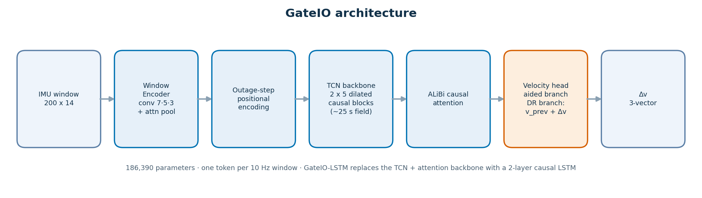
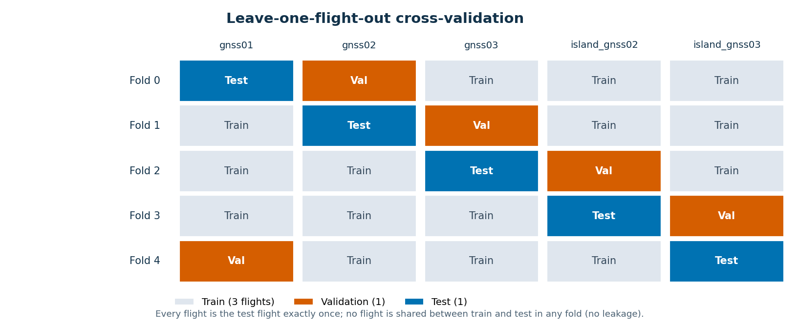
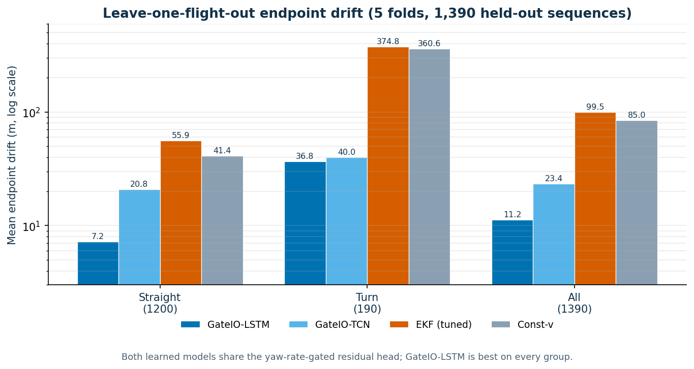
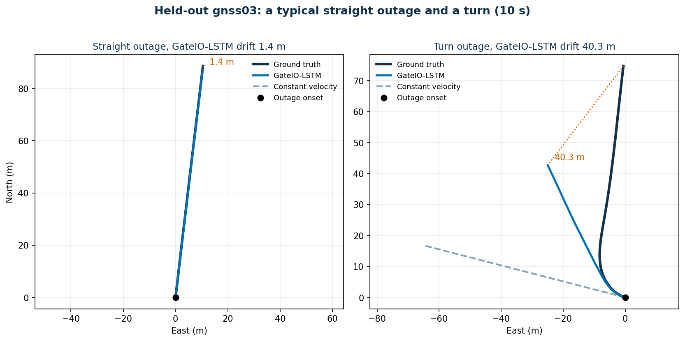

# GateIO: Learned Dead Reckoning for UAV GPS-Outage Bridging, Tested Across Held-Out Flights

**Nandini Saxena**
nsaxena23-cse@bvucoep.edu.in, nandinisaxenawork@gmail.com
Code: https://github.com/nandini1612/gateio

---

## Abstract

When a UAV loses GPS, it has to track its own motion from the inertial sensors until the signal returns. Holding the last velocity works while the aircraft flies straight, but as soon as it turns the horizontal velocity changes with the yaw rate, and a straight-line guess drifts fast. GateIO is a small causal model that predicts GPS velocity through the outage from the inertial data and the last velocity the GPS reported. It carries one rule from flight physics: when the yaw rate is low it stays near the last known velocity, and when the yaw rate is high that rule is dropped so the model can learn the turn. GateIO names a formulation rather than one network; we test it with two backbones, a recurrent one and a convolution-plus-attention one.

Two findings shape the paper. The first is about how to test such a model: if the train, validation, and test windows are cut from the same flights, information leaks across them and the model looks very good, about 7 m of drift over a 10-second outage. We instead hold out whole flights, one at a time, and evaluate on flights the model never saw. The drift then rises to 11.2 m for the recurrent backbone, averaged over 1,390 held-out outages, still about 7.5 times lower than a tuned extended Kalman filter (99.5 m) and a constant-velocity baseline (85.0 m), and ten times lower on turns. The second finding is that the backbone matters less than the formulation: a higher-capacity convolution-plus-attention network reaches only 23.4 m on the same held-out flights, worse than the simpler recurrent one, which we attribute to the small five-flight dataset. We treat the leakage-free numbers as the real ones. Learning helps, but cross-flight bridging is far from solved.

## 1. Introduction

Small UAVs lose GPS often enough that it has to be planned for: near buildings, under bridges, and where the signal is jammed. A gap of a few seconds during a manoeuvre is enough to put the position estimate badly off.

The usual answer is a Kalman filter with a constant-velocity or constant-acceleration model. It does well on straight flight. Its weakness is that it cannot tell a turn is happening, so it keeps projecting the old velocity forward and the error runs away. A learned model can do better here, because it can pick up motion patterns a fixed model ignores. Most learned inertial odometry so far is built for pedestrians or ground and hand-held devices. Flight is a harder case: the speeds are higher, the aircraft banks into turns, and the useful signal is split across the accelerometer, the gyroscope, and the attitude estimate.

GateIO predicts GPS velocity during the outage and integrates it to a position. Its one prior comes from how aircraft fly: at low yaw rate the horizontal velocity barely changes, so the model is kept near the last known velocity; at high yaw rate the prior is switched off and the drift term takes over. The contributions are three. First, the formulation itself, a yaw-rate gate with a residual output head, which we instantiate with two backbones, a two-layer LSTM and a convolution-plus-attention network, and find that the recurrent one generalises better on this data. Second, an evaluation that shows a within-flight split overstates accuracy by a wide margin. Third, an error analysis that explains why an earlier version did not generalise, and a fix that recovers most of the loss on unseen straight flight. We do not oversell the result: under the honest setup the best model's mean drift is 11.2 m and 55% of outages stay under 5 m.

## 2. Related Work

Learned inertial odometry usually predicts a short-horizon motion increment rather than an absolute pose. IONet posed pedestrian inertial odometry as regressing a polar displacement increment from a window of IMU data. RoNIN regressed velocity in a stabilised frame, set strong baselines, and released a benchmark that much of the later work reports against. GateIO follows this line: its output is a velocity increment over the last known velocity.

A second thread adds an uncertainty estimate and hands it to a filter, so the filter can lean on its own motion model when the network is unsure. TLIO regressed a 3D displacement with its covariance and fused both into a stochastic-cloning EKF. AirIO carried this to aerial data, predicting body-frame velocity with uncertainty, and reports that most of its improvement comes from the uncertainty term rather than the point prediction. AI-IMU takes the opposite division of labour and learns only the noise covariances of an invariant EKF, leaving the integration to the filter. CTIN applies a transformer to inertial navigation with a covariance output. GateIO does not model uncertainty; it is a point estimate, which we list as a limitation and a direction for the next version.

Against this work, GateIO is deliberately small and aerial-specific. It adds a physical gate keyed to yaw rate, predicts an increment so its default is to hold velocity, and uses ALiBi attention so it handles outage lengths not seen in training. Its second contribution is on evaluation rather than architecture, which the sections below develop. The data is MARS-LVIG, an aerial LiDAR-visual-inertial-GNSS dataset recorded on a DJI M300 RTK; we use only its inertial and GNSS-velocity streams.

## 3. Data and Preprocessing

We use five flights from MARS-LVIG: three over an airport (gnss01, gnss02, gnss03) and two over an island (island_gnss02, island_gnss03). RTK GPS gives the ground-truth velocity. The IMU stream is cut into windows of 200 samples (1.0 s at 200 Hz), stepped so that a prediction is produced every 0.1 s. Each window holds 14 channels: accelerometer (3), gyroscope (3), the attitude quaternion in body-to-navigation frame (4), GPS velocity (3, zeroed during an outage), and an outage flag. A sequence spans 300 windows, or 30 s. An outage is created by zeroing the GPS channels for 100 windows (10 s) starting at window 100. Channels and targets are scaled by the median and inter-quartile range of the training set only; the quaternion channels are left unscaled. Two flights, gnss03 and island_gnss03, hold most of the turning, which matters for how the folds are built.

## 4. Method

### 4.1 Architecture

GateIO has a shared front end and head, with the backbone as the one interchangeable part. A window encoder turns each 200-sample window into a 48-dimensional token using three 1D convolutions (kernels 7, 5, 3) with group normalisation, then attention pooling. An outage-step encoding adds a sinusoidal count of steps since the outage began, reset whenever GPS is available. A velocity head has two branches, one for GPS-aided steps and one for outage steps, the second taking the last known velocity as input. Between the encoder and the head sits the backbone, for which we test two options. GateIO-LSTM uses a two-layer causal LSTM (265,334 parameters). GateIO-TCN uses dilated causal convolutions with a receptive field near 25 s, feeding one layer of causal attention with ALiBi bias (186,390 parameters). Everything else is identical. On held-out flights the recurrent backbone is the more accurate of the two (Section 6), so we treat GateIO-LSTM as the primary model.

The diagram shows the GateIO-TCN backbone; GateIO-LSTM replaces the convolution-and-attention block with the two-layer LSTM and is otherwise identical.

### 4.2 The yaw-rate gate

On outage windows where the yaw rate is below 0.10 rad/s, a loss term pulls the predicted velocity change toward zero, which amounts to holding the last known velocity. Above that threshold the gate is off and the drift loss shapes the output. An earlier version applied this prior on every outage window; on turns it pulled against the drift loss and lost. Gating it by yaw rate is what lets the prior carry real weight.

### 4.3 Residual output

An early GateIO predicted absolute velocity. It did well inside a flight and poorly across flights: on unseen straight flight it drifted about 30 m, where simply holding the last velocity drifted about 2 m. Two things caused this. The model produced a nearly constant velocity error of a few m/s on the forward axis and did not fall back on the last known velocity, which was almost exactly right. And the prior, as written, pulled the output toward the training-set median speed rather than toward the last known speed. The fix is to predict a residual. The outage head now outputs the change in velocity over the last known value, scaled by the typical size of that change. A zero output is exactly hold-the-last-velocity, so under an input shift on a new flight the model backs off to persistence instead of to a biased guess. This is the increment-prediction idea from the learned-odometry literature. With the residual head and the corrected prior, straight-flight error on held-out flights drops back close to the persistence floor.

### 4.4 Training

AdamW at learning rate 8e-4, a one-cycle schedule, batch size 16, up to 200 epochs with early stopping. Turn windows are up-weighted. The loss has a data term on GPS-aided steps, a drift term on outage steps, the gated persistence prior, and small smoothness and cumulative-position terms.

## 5. Evaluation Protocol

### 5.1 Two splits

The within-flight split cuts each flight 80/10/10 into train, validation, and test in time order. The validation and test parts are the tail ends of flights whose earlier parts are used for training. Because a 30 s sequence and a 25 s receptive field are long next to those boundaries, and because flight dynamics drift slowly, validation and test end up close to the training distribution. The leave-one-flight-out split instead assigns whole flights to each role. Five folds run in turn: each flight is the test flight once, three flights train the model, and one held-out flight is used for validation and model selection. No test window comes from a flight that also appears in training.

### 5.2 Why the difference matters

Under the within-flight split GateIO reaches about 7 m and is selected on validation drift. But there, a lower validation drift can go with a worse result on a genuinely held-out flight, because the split rewards fitting patterns specific to a flight. We saw this directly in training: an earlier checkpoint with higher validation drift (17 m) reached lower test drift (9.5 m) than the checkpoint the validation metric selected (7 m validation, 12 m test). So the split distorts not only the reported number but the choice of checkpoint. Leave-one-flight-out removes both problems. The cost is a much smaller effective dataset, with a single flight for validation and a single flight for test in each fold.

## 6. Results

### 6.1 Leave-one-flight-out

Pooled over 1,390 held-out sequences across the five flights. A sequence is labelled Turn when its mean yaw rate during the outage is above 0.10 rad/s, and Straight otherwise. Endpoint drift is in metres; lower is better.

Both learned models use the same yaw-rate-gated residual head; they differ only in the backbone.

| Group | GateIO-LSTM | GateIO-TCN | EKF | Const-v | LSTM < 5 m |
|---|---:|---:|---:|---:|---:|
| Straight (1200) | **7.2** | 20.8 | 55.9 | 41.4 | 62% |
| Turn (190) | **36.8** | 40.0 | 374.8 | 360.6 | 6% |
| All (1390) | **11.2** | 23.4 | 99.5 | 85.0 | 55% |

By flight, GateIO-LSTM's all-sequence drift is 4.1 (gnss01), 11.1 (gnss02), 20.3 (gnss03), 16.5 (island_gnss02), and 30.1 m (island_gnss03); the recurrent backbone wins on four of the five flights, the convolutional one only on gnss03. Against the constant-velocity baseline GateIO-LSTM's drift is 7.6 times lower, and against the tuned EKF 8.9 times lower; on turns the factor is about ten, on straight flight about six. The constant-velocity baseline is not sharp on straight flight here (41 m): across flights, even low-yaw segments change speed, which is why a learned velocity model helps and holding the last velocity does not. The convolution-plus-attention backbone tracks turns about as well but carries a heavy tail on straight flight: its median drift is 10.8 m, yet individual sequences reach past 60 m, which is what lifts its mean to 23.4 m.

Figure 4 shows two held-out outages on gnss03: a typical straight segment and a turn. On the straight segment, the common case, GateIO-LSTM tracks the true path within a few metres over ten seconds. On the turn, constant velocity leaves along the pre-outage heading and diverges from the true path, while GateIO-LSTM follows the curve and its error stays bounded. Turns are about one outage in seven, and they are where the learned model earns its margin over the classical baselines.

### 6.2 Within-flight, for contrast

On the within-flight split the models reach about 7 m, with straight sequences near 1 to 2 m. We report it only to show the size of the leakage: the distance between 7 m and the leakage-free numbers is what the split adds.

| Metric (within-flight) | GateIO-LSTM | GateIO-TCN | EKF | Const-v |
|---|---:|---:|---:|---:|
| Mean, val (m) | 7.78 | 6.72 | 74.80 | 30.64 |
| Mean, test (m) | 42.50 | 34.11 | 58.16 | 62.97 |
| % < 5 m, val | 79.7% | 76.3% | 13.6% | 74.6% |
| % < 5 m, test | 0.0% | 0.0% | 11.9% | 84.7% |

In-distribution the convolutional backbone looks slightly better than the recurrent one, the reverse of the held-out ranking. That is one more reason to trust only the leakage-free result.

### 6.3 Diagnosis

A substitution test pins down the cause. On the sealed test set, before the residual head, we replaced the model's output with the last known velocity on gated straight windows only, leaving the turn windows to the model. Straight-flight drift collapsed (Table 3): straight-short fell from 30.4 m to 0.8 m, below even the constant-velocity baseline. The error sat entirely in the learned straight-flight prediction, not in the architecture and not on the turns. That result led to the residual head in Section 4.3, which makes holding velocity the model's default rather than a substitution applied by hand.

| Test group | GateIO | Hold velocity on straight | Const-v |
|---|---:|---:|---:|
| straight-short | 30.4 | **0.8** | 2.1 |
| straight-med | 17.5 | **1.6** | 2.2 |
| false-alarm | 16.3 | **2.9** | 1.6 |

*Table 3. Substituting the last known velocity on gated straight windows recovers almost all of the drift, isolating the failure to the learned straight-flight prediction.*

## 7. Discussion

GateIO beats classical dead reckoning on unseen flights, and it wins by the most where the classical methods fail worst, on turns. It also picks up the speed changes on straight flight that a constant-velocity model misses. The size of the leakage is the second finding. A within-flight split is easy to set up and common, and it made the convolutional backbone look about three times better than it is and even reversed which backbone appeared best, so a fair comparison of GPS-outage methods on this kind of data should hold out whole flights. A third point concerns the backbone: the extra capacity of the convolution-plus-attention network did not pay off. On five flights the two-layer LSTM generalised better and more stably, so we report it as the primary model and read the architecture comparison as specific to this small dataset rather than a general claim. The largest error that remains is that the model has no way to say it is unsure and hold the last velocity; the residual head gives it a safe default, but a learned uncertainty output fused with a filter is the direction that has helped most in related aerial work.

## 8. Limitations

The dataset is small: five flights, two sites, one platform. Leave-one-flight-out then gives five folds with one validation and one test flight each, so a per-flight number carries little statistical weight, and this is the main limit on how far the results reach; it is also the most likely reason the higher-capacity backbone generalises worse than the recurrent one. The absolute accuracy is modest, 11 m mean and 55% of outages under 5 m for the best model, which is a research result rather than a fielded system. The backbone comparison is dataset-bound: the recurrent network wins here, but on a larger, more varied dataset the ordering could change. GateIO outputs a point estimate, with no uncertainty and no filter coupling. And the learned comparison is between two backbones of our own, not against a published method run on this data.

## 9. Conclusion

GateIO bridges UAV GPS outages by predicting velocity from inertial data, held near the last known value on straight flight and free to react in turns. Tested the easy way it looks very accurate. Tested by holding out whole flights, the recurrent backbone reaches 11.2 m, about 7.5 times better than the best classical baseline but far from solved; the higher-capacity convolutional backbone does worse, at 23.4 m. We report the leakage-free numbers, show why the common split inflates results, and point to more data and a learned uncertainty output as the next steps.

## Reproducibility

The code, the preprocessing, the leave-one-flight-out fold builder, and the evaluation scripts are public at https://github.com/nandini1612/gateio. The MARS-LVIG dataset is openly available (Li et al., 2024). The protocol in Section 5 (window size, outage placement, fold assignment, training-only normalisation, and the endpoint-drift metric) is fixed in the released scripts, so every number in this paper can be regenerated.

## References

- Brossard, M., Barrau, A., & Bonnabel, S. (2020). AI-IMU dead-reckoning. *IEEE Transactions on Intelligent Vehicles, 5*(4), 585–595. https://doi.org/10.1109/TIV.2020.2980758
- Chen, C., Lu, X., Markham, A., & Trigoni, N. (2018). IONet: Learning to cure the curse of drift in inertial odometry. *Proceedings of the AAAI Conference on Artificial Intelligence, 32*(1), 6468–6476.
- Cioffi, G., Bauersfeld, L., Kaufmann, E., & Scaramuzza, D. (2023). Learned inertial odometry for autonomous drone racing. *IEEE Robotics and Automation Letters, 8*(5), 2684–2691. https://doi.org/10.1109/LRA.2023.3252342
- Herath, S., Yan, H., & Furukawa, Y. (2020). RoNIN: Robust neural inertial navigation in the wild: Benchmark, evaluations, & new methods. *IEEE International Conference on Robotics and Automation (ICRA)*, 3146–3152. https://doi.org/10.1109/ICRA40945.2020.9196860
- Li, H., Zou, Y., Chen, N., Lin, J., Liu, X., Xu, W., Zheng, C., Li, R., He, D., Kong, F., Cai, Y., Liu, Z., Zhou, S., Xue, K., & Zhang, F. (2024). MARS-LVIG dataset: A multi-sensor aerial robots SLAM dataset for LiDAR-visual-inertial-GNSS fusion. *The International Journal of Robotics Research, 43*(8), 1114–1127. https://doi.org/10.1177/02783649241227968
- Liu, W., Caruso, D., Ilg, E., Dong, J., Mourikis, A. I., Daniilidis, K., Kumar, V., & Engel, J. (2020). TLIO: Tight learned inertial odometry. *IEEE Robotics and Automation Letters, 5*(4), 5653–5660. https://doi.org/10.1109/LRA.2020.3007421
- Press, O., Smith, N. A., & Lewis, M. (2022). Train short, test long: Attention with linear biases enables input length extrapolation. *International Conference on Learning Representations (ICLR)*. arXiv:2108.12409
- Qiu, Y., Xu, C., Chen, Y., Zhao, S., Geng, J., & Scherer, S. (2025). AirIO: Learning inertial odometry with enhanced IMU feature observability. arXiv:2501.15659.
- Rao, B., Kazemi, E., Ding, Y., Shila, D. M., Tucker, F. M., & Wang, L. (2022). CTIN: Robust contextual transformer network for inertial navigation. *Proceedings of the AAAI Conference on Artificial Intelligence, 36*(5), 5413–5421. https://doi.org/10.1609/aaai.v36i5.20479
